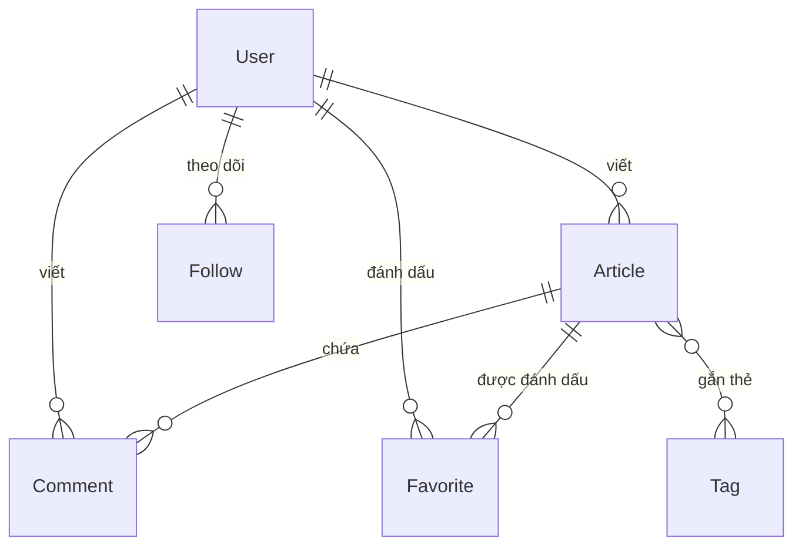

# System Architecture

API cho nền tảng xuất bản bài viết, triển khai theo
[RealWorld specification](https://realworld-docs.netlify.app/specifications/backend/endpoints).
Ứng dụng NestJS monolithic, PostgreSQL làm primary data source, Redis giữ state ngắn hạn.

> **Tài liệu này vẽ hình dạng và ghi lý do. Không chứa chi tiết implementation.**
> Field và data type → `prisma/schema.prisma`. Request/response contract → API docs
> `/api/docs`. Scope từng milestone → GitHub issues.
>
> Mục đánh dấu **`PLANNED`** mô tả phần chưa tồn tại. Hiện chỉ milestone 1 đã build.

---

## 1. Stack

| Layer | Chọn | Lý do |
|---|---|---|
| Runtime | Node.js 24 | LTS đến 2028-04; Node 25 đã EOL 2026-06 |
| Framework | NestJS 12 | Bản `nest new` sinh ra; scaffold build và test xanh ngay |
| TypeScript | 6 | Do starter ghim |
| Database | PostgreSQL 17 | uuid native, `ILIKE`, partial index cho bảng polymorphic |
| ORM | Prisma 7 + `@prisma/adapter-pg` | Type generate từ schema; migration là SQL thuần |
| Cache | Redis 7 + ioredis | Token revocation, queue backend |
| Validation | Zod | Standard Schema — NestJS 12 nhận thẳng, không cần adapter (§6.6) |
| Authentication | `@nestjs/jwt` + `passport-jwt` | |
| Password hashing | bcrypt | |
| API docs | `@nestjs/swagger` sinh OpenAPI document, Scalar render | Swagger UI không dùng |
| i18n | `nestjs-i18n` | `en`, `vi` |
| Upload | Multer | Đi kèm `@nestjs/platform-express` |
| Queue | `@nestjs/bullmq` | BullMQ là bản đang được maintain |
| Test | Vitest + Supertest | Do starter sinh ra, không phải Jest |
| Lint | oxlint + Prettier + Sunlint | Starter dùng oxlint thay ESLint |

Version chính xác nằm ở `package.json`. Môi trường development chạy bằng Docker Compose.

---

## 2. API conventions

Áp cho mọi endpoint. Shape cụ thể của từng endpoint xem API docs.

| | |
|---|---|
| Prefix | `/api` |
| Authentication | `Authorization: Token <jwt>` — **không phải** `Bearer`. Document khai bằng `addApiKey` |
| Envelope | Mọi response bọc trong root key: `user`, `profile`, `article`, `articles` + `articlesCount`, `comment`, `comments`, `tags` |
| Error | `{ "errors": { "<key>": ["..."] } }` cho mọi status — xem bảng key bên dưới |
| Pagination | `limit` default 20, `offset` default 0 |

**Error key.** Không phải một key `body` cố định. Key nói lỗi thuộc về cái gì:

| Key | Dùng khi | Ví dụ |
|---|---|---|
| tên field | validate hỏng, hoặc field trùng unique | `{"email": ["can't be blank"]}` |
| `credentials` | login sai email hoặc password | `{"credentials": ["invalid"]}` |
| `token` | thiếu, sai, hoặc hết hạn token | `{"token": ["is missing"]}` |
| tên resource | 403 và 404 | `{"article": ["not found"]}` |

**Status code:**

| | |
|---|---|
| 422 | Validation thất bại — thiếu field, sai định dạng, quá ngắn |
| 409 | Vi phạm ràng buộc unique — username hoặc email đã có người dùng |
| 401 | Chưa xác thực được: không gửi token, token sai/hết hạn, **hoặc login sai credential** |
| 403 | Request hợp lệ nhưng không có permission — sửa/xoá resource không thuộc về mình |
| 404 | Không tìm thấy resource |

`StandardSchemaValidationPipe` mặc định trả 400, chỉnh bằng `errorHttpStatusCode`.

Trang [error-handling](https://realworld-docs.netlify.app/specifications/backend/error-handling/)
của RealWorld mô tả một format cũ (`{errors:{body:[...]}}`, 422 cho mọi thứ) và chưa từng được
cập nhật kể từ lần chuyển thư mục. Bảng trên bám theo `specs/api/hurl/` trong repo
`gothinkster/realworld` — thứ CI của họ thật sự chạy. Chi tiết đối chiếu ở
`plans/reports/researcher-260910-1524-realworld-auth-contract.md`.

**Endpoint optional-auth trả body khác nhau** tuỳ có token hay không: `following` và
`favorited` phụ thuộc viewer. Đây là chỗ dễ sót nhất khi viết test.

**Ownership:** chỉ author sửa hoặc xoá được article và comment của mình.

---

## 3. Module structure

```
src/
├── main.ts
├── app.module.ts
├── config/            validate environment variable lúc bootstrap
├── prisma/            PrismaModule, PrismaService
├── redis/             RedisModule, RedisService
├── i18n/              en/, vi/
├── hello/             tạm thời, gỡ khi có endpoint thật
│
│                      ── dưới đây là PLANNED ──
├── common/            decorators, filters, guards, interceptors, pipes
└── modules/           auth, users, profiles, articles, comments, tags, attachments
```

### Dependency boundaries

| Module | Được phụ thuộc vào |
|---|---|
| `common`, `config`, `prisma`, `redis` | không phụ thuộc domain module nào |
| `attachments` | `prisma` |
| `users` | `prisma`, `attachments` |
| `auth` | `users` |
| `profiles` | `users` |
| `tags` | `prisma` |
| `articles` | `users`, `tags`, `attachments` |
| `comments` | `articles`, `users` |

Dependency chỉ đi một chiều theo bảng trên. `attachments` không bao giờ import domain module
nào — nó công bố interface, module owner tự register vào (§6.5).

`author.following` xuất hiện nested trong cả article lẫn comment response. Đó là **shared query
đặt tại `users`**, không phải dependency edge mới giữa `comments` và `profiles`.

---

## 4. Data model · `PLANNED`

Chưa có model nào. Field, type và constraint thuộc về `prisma/schema.prisma`.



| Model | Vai trò |
|---|---|
| `User` | Account và profile |
| `Article` | Bài viết, public identifier là `slug` |
| `Tag` | Nhiều-nhiều với `Article` qua join table |
| `Comment` | Thuộc một `Article` và một `User` |
| `Favorite` | Join table `User` × `Article` |
| `Follow` | Self-referencing `User` |
| `Attachment` | Polymorphic, **không** foreign key (§6.4) |

`Attachment` đứng ngoài sơ đồ vì không có foreign key tới model nào.

**Avatar:** `Attachment` là source of truth, `User.image` giữ URL derived để đọc profile khỏi join.
Ngoại lệ có chủ đích: `PUT /user` được ghi thẳng `User.image` vì spec cho phép client gửi URL
bất kỳ. Mọi path khác đi qua upload service.

---

## 5. Request flow · `PLANNED`

```
Request
  ├─ Middleware        i18n resolver
  ├─ Guard             JwtAuthGuard | OptionalJwtAuthGuard
  │                    decode JWT, check blacklist trong Redis
  ├─ Pipe              StandardSchemaValidationPipe → Zod schema
  ├─ Handler           Controller → Service → PrismaService
  ├─ Interceptor       StandardSchemaSerializerInterceptor → cắt field + bọc envelope
  └─ ExceptionFilter   chuẩn hoá error theo §2
```

Endpoint optional-auth dùng `OptionalJwtAuthGuard`: không có token vẫn đi tiếp.

---

## 6. Design decisions

### 6.1 Prisma làm ORM

**Context.** Hướng dẫn của module đề xuất TypeORM.

**Decision.** Dùng Prisma.

**Consequence.** Type generate từ schema thay vì suy từ decorator; không có bẫy `synchronize`;
migration là SQL thuần review được. Đổi lại: không có down migration (§6.2), không model được
polymorphic relation (§6.4), và phải tự viết `PrismaService` vì không có module chính chủ.

### 6.2 Migration không có down

**Context.** Cần đủ bốn thao tác add / apply / revert / reset. Prisma không hỗ trợ down migration.

**Decision.** Ba thao tác đầu bọc thành npm script. Revert làm thủ công, không dựng tooling —
development database là database vứt được.

**Consequence.** Muốn revert được thì phải sinh script nghịch **trước khi** apply migration —
apply xong là mất luôn state cũ để diff. Recipe đầy đủ ở `CLAUDE.md`.

### 6.3 Serialization hai tầng · `PLANNED`

**Context.** Password hash không được xuất hiện trong response. Dựa vào việc nhớ loại nó ra ở
từng handler là kiểu bảo vệ sớm muộn cũng thủng.

**Decision.** Chặn hai lần, độc lập nhau.

Tầng một, ở source: Prisma client `omit` password ngay khi query, chỉ query login mở lại bằng
`omit: { password: false }` vì cần hash để `bcrypt.compare`.

Tầng hai, ở boundary: mỗi resource một response schema, khai qua
`@SerializeOptions({ schema })`. `StandardSchemaSerializerInterceptor` parse response qua schema
đó trước khi trả về. Schema vừa cắt field vừa bọc envelope:

```ts
z.object({ email: z.string(), username: z.string(), bio: z.string().nullable(),
           image: z.string().nullable(), token: z.string() })
 .transform((user) => ({ user }))
```

**Consequence.** Tầng hai là **allowlist** — field không khai trong schema thì bị Zod cắt, kể cả
field mới thêm vào model sau này. Mạnh hơn cách denylist kiểu `@Exclude()`, vốn quên gắn là lộ.
Không handler nào tự viết envelope.

Cần **hai response schema riêng cho article**: từ 2024-08-16 spec bỏ `body` khỏi list và feed
response, chỉ `GET /articles/:slug` còn trả.

### 6.4 Polymorphic attachment · `PLANNED`

**Context.** Attachment cần gắn được vào nhiều loại owner mà module `attachments` không phải
biết đến chúng.

**Decision.** `Attachment` mang `attachableType` + `attachableId`, primary key uuid,
không foreign key.

**Consequence.** Thêm owner type mới không cần đổi schema. Đổi lại database không giữ referential
integrity, nên hai việc phải làm ở application layer: xoá owner phải xoá attachment trong cùng
transaction, và luôn batch load attachment thay vì query từng dòng.

### 6.5 Attachment authorization · `PLANNED`

**Context.** `GET /uploads/:id` phải check permission, nhưng `Attachment` không có foreign key nên
`attachments` không tự biết owner là ai. Gọi thẳng `users` và `articles` sẽ tạo circular dependency.

**Decision.** Đảo chiều dependency. `attachments` công bố interface `AttachmentPolicy`;
mỗi owner module tự register policy của mình qua multi-provider token.

**Consequence.** Dependency vẫn một chiều. Thêm owner type mới chỉ cần thêm policy ở module mới,
không sửa `attachments`. Đổi lại thêm một lớp indirection, và quên register policy chỉ lộ lúc runtime.

### 6.6 Zod thay class-validator

**Context.** Hướng dẫn của module dạy `ValidationPipe` + class-validator + class-transformer.
Repo đã có Zod sẵn để validate environment variable, nên đi theo hướng dẫn nghĩa là nuôi hai thư
viện validation cho cùng một việc.

**Decision.** Dùng Zod cho cả ba chỗ: environment, request, response. Gỡ `class-validator` và
`class-transformer`.

Zod 4 khai báo `~standard`, mà NestJS 12 nhận Standard Schema như công dân hạng nhất — schema gắn
vào tham số bằng `@Body({ schema })`, `StandardSchemaValidationPipe` đăng ký global một lần đọc
schema đó ra từ `ArgumentMetadata`. Không có adapter, không có pipe tự viết.

**Consequence.** Một thư viện validation, một nguồn sự thật: `z.infer` sinh type từ schema thay
vì phải nuôi song song class và decorator.

Format lỗi field-keyed ở §2 rơi ra tự nhiên: Zod trả `issue.path` tách khỏi `issue.message`, nên
`exceptionFactory` chỉ việc lấy segment cuối của path làm key. class-validator thì ngược lại — nó
nhét tên field vào trong message (cả 101 template mặc định), hợp với format phẳng chứ không hợp
field-keyed.

`@nestjs/swagger` 12 có `StandardSchemaOpenApiConverter` đọc thẳng schema từ `@Body({ schema })`,
nên OpenAPI vẫn tự sinh, không phải khai `@ApiBody` tay.

Đổi lại: lệch tài liệu khoá học lần thứ hai, sau §6.1. Mọi ví dụ NestJS ngoài kia vẫn viết bằng
class-validator, nên người đọc code lần đầu sẽ thấy lạ. `nestjs-zod` không dùng — peer dependency
của nó dừng ở `@nestjs/common ^11`, và việc nó làm thì NestJS 12 đã làm sẵn.
