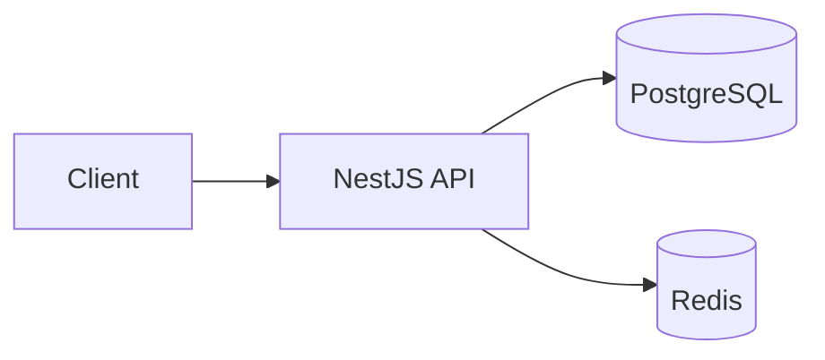

# System Architecture

Backend API cho nền tảng xuất bản bài viết theo RealWorld specification: quản lý tài khoản,
profile, bài viết, bình luận, theo dõi người dùng và đánh dấu bài viết yêu thích.

Tài liệu mô tả **target architecture** và lý do của các quyết định chính. Các thành phần bên
dưới không đồng nghĩa với việc đã được triển khai đầy đủ; tiến độ và scope nằm ở GitHub issues.

## 1. System overview

Ứng dụng là một **modular monolith** dùng NestJS. Các domain module chạy trong cùng ứng dụng,
phân chia theo business responsibility và có dependency boundary rõ ràng.

| Thành phần | Trách nhiệm |
|---|---|
| NestJS API | Xử lý request, authentication, authorization và business logic |
| PostgreSQL | Primary data source cho tài khoản và nội dung |
| Redis | State ngắn hạn cho token revocation và backend cho queue |

Prisma quản lý data access và database schema. Zod định nghĩa validation và response
schema. OpenAPI cung cấp contract để client tích hợp với API.

## 2. Module boundaries

| Module | Trách nhiệm | Domain dependency được phép |
|---|---|---|
| `auth` | Registration, login, token issuance và token verification | `users` |
| `users` | Tài khoản và profile của người dùng | `attachments` |
| `profiles` | Profile công khai và quan hệ theo dõi | `users` |
| `articles` | Bài viết, feed và yêu thích | `users`, `tags`, `attachments` |
| `comments` | Bình luận trên bài viết | `articles`, `users` |
| `tags` | Nhãn phân loại bài viết | — |
| `attachments` | Tệp đính kèm và liên kết với owner | — |

Các infrastructure module như configuration, database, Redis và xử lý request dùng chung không
phụ thuộc domain module. Domain module có thể sử dụng infrastructure cần thiết cho trách nhiệm của mình.

Dependency giữa domain module đi một chiều theo bảng trên. Logic được dùng chung đặt tại
module sở hữu dữ liệu hoặc khái niệm đó; chẳng hạn thông tin người dùng và quan hệ theo dõi
được cung cấp từ `users` cho các response bài viết và bình luận.

`auth` sở hữu registration vì thao tác này vừa tạo tài khoản vừa phát hành token. `users` quản lý
tài khoản mà không cần phụ thuộc ngược vào `auth`.

## 3. Conceptual data model

| Khái niệm | Vai trò và quan hệ |
|---|---|
| User | Tài khoản và profile; có thể viết bài, bình luận, theo dõi và yêu thích |
| Article | Bài viết thuộc một User, có nhiều Comment và nhiều Tag |
| Comment | Bình luận thuộc một Article và được viết bởi một User |
| Tag | Nhãn có thể gắn với nhiều Article |
| Favorite | Quan hệ một User yêu thích một Article |
| Follow | Quan hệ có hướng giữa người theo dõi và người được theo dõi |
| Attachment | Tệp có thể thuộc nhiều loại owner, chẳng hạn User hoặc Article |

PostgreSQL bảo vệ referential integrity của các relationship thông thường bằng constraint.
Attachment là ngoại lệ có chủ đích: polymorphic relationship được quản lý ở application layer,
như giải thích ở §5.

## 4. Request flow và API conventions

Một request đi qua authentication và authorization phù hợp, validation, business logic,
data access và serialization trước khi trả về client. Lỗi ở các bước được chuyển về cùng một format.

Controller tiếp nhận request và chuyển cho service xử lý. Service giữ business logic; Prisma
cung cấp data access. Validation và serialization là quy tắc chung tại API boundary.

| Nguyên tắc | Thiết kế |
|---|---|
| Routing | API dùng prefix `/api` |
| Authentication | JWT qua header `Authorization: Token <jwt>`; Redis lưu state cho token revocation. Guard kiểm tra token thuộc request pipeline dùng chung, strategy do `auth` đăng ký |
| Token trong response | Endpoint trả về tài khoản kèm token trả lại đúng token client gửi lên, không phát hành token mới; mỗi lần đăng nhập vì vậy chỉ tồn tại một token và thao tác thu hồi kết thúc trọn session |
| Authorization | Chỉ author được sửa hoặc xoá bài viết và bình luận của mình |
| Optional authentication | Một số endpoint cho phép không đăng nhập; dữ liệu quan hệ như `following` và `favorited` phụ thuộc người xem |
| Response envelope | Dữ liệu bọc trong root key của resource; response schema xác định field được công khai |
| Error format | Format thống nhất `{ "errors": { "<key>": ["..."] } }`; key chỉ field hoặc đối tượng gây lỗi |
| Internal error | Client nhận thông báo chung; chi tiết được ghi vào log |

Contract cụ thể của endpoint, status code và tham số nằm trong API docs.

## 5. Design decisions

### Prisma cho data access

Dùng Prisma thay cho TypeORM trong tài liệu khoá học. Schema là nguồn định nghĩa model và
type được generate từ đó; migration SQL có thể review trực tiếp.

Đánh đổi: quy trình khác với ví dụ của khoá học, không có down migration tự động và không
biểu diễn trực tiếp polymorphic relationship. Quy trình vận hành migration nằm trong `CLAUDE.md`.

### Một hệ thống schema cho validation và serialization

Dùng Zod cho environment configuration, request và response. Type được infer từ schema để tránh
duy trì song song định nghĩa validation và định nghĩa TypeScript.

Đánh đổi: cách tổ chức khác với các ví dụ NestJS dùng class-validator trong khoá học.

### Bảo vệ sensitive data ở query layer và API boundary

Password hash mặc định bị loại khỏi query result; chỉ luồng cần kiểm tra mật khẩu mới
đọc nó. Tại API boundary, response schema chỉ cho phép các field được khai báo đi ra ngoài.

Hai tầng có trách nhiệm riêng: giảm việc truyền sensitive data trong ứng dụng và giữ
public contract ổn định khi model thay đổi. Đánh đổi là cần duy trì response schema riêng
với persistence model.

### Polymorphic attachment và authorization theo owner

Attachment liên kết với owner bằng type và ID, không có foreign key tới từng loại
owner. Nhờ đó module `attachments` không cần biết các domain module sử dụng nó.

Owner module cung cấp authorization policy cho attachment của mình. `attachments` dùng policy
đó mà không import ngược owner module, giữ dependency một chiều.

Đánh đổi: application chịu trách nhiệm kiểm tra owner, xoá attachment cùng transaction khi
xoá owner và bảo đảm policy tương ứng được đăng ký.

Avatar dùng Attachment làm nguồn quản lý tệp, còn `User.image` giữ URL để đọc profile.
Theo contract RealWorld, cập nhật profile cũng cho phép client đặt URL ảnh trực tiếp.

## 6. Phạm vi cập nhật tài liệu

Cập nhật tài liệu khi thay đổi thành phần hệ thống, trách nhiệm hoặc dependency giữa module,
data relationship, API convention dùng chung hay design decision quan trọng.

Triển khai endpoint theo thiết kế đã thống nhất, thêm class hoặc hoàn thành milestone không
tự tạo ra nhu cầu cập nhật tài liệu này.

| Thông tin cần tra cứu | Nguồn |
|---|---|
| Field, type và constraint cụ thể | `prisma/schema.prisma` |
| Request/response contract | API docs tại `/api/docs` |
| Naming và coding convention | `docs/code-standards.md` |
| Lệnh phát triển và quy trình migration | `CLAUDE.md` |
| Dependency và phiên bản | `package.json` |
| Scope và tiến độ triển khai | GitHub issues |
| Workaround và chi tiết implementation | Code và comment tại nơi áp dụng |
